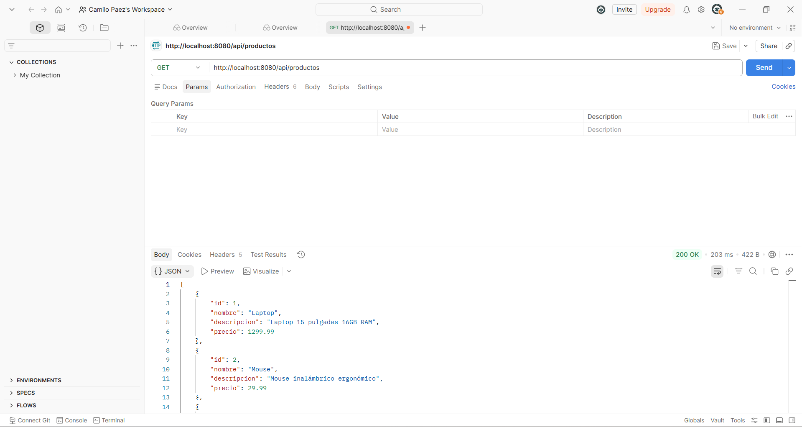
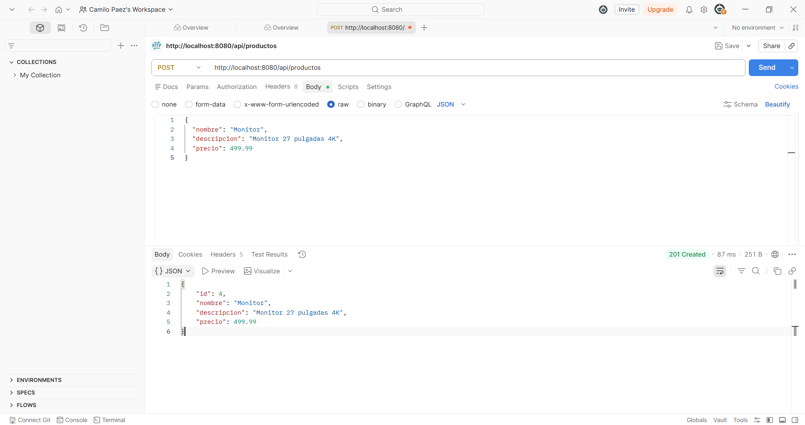
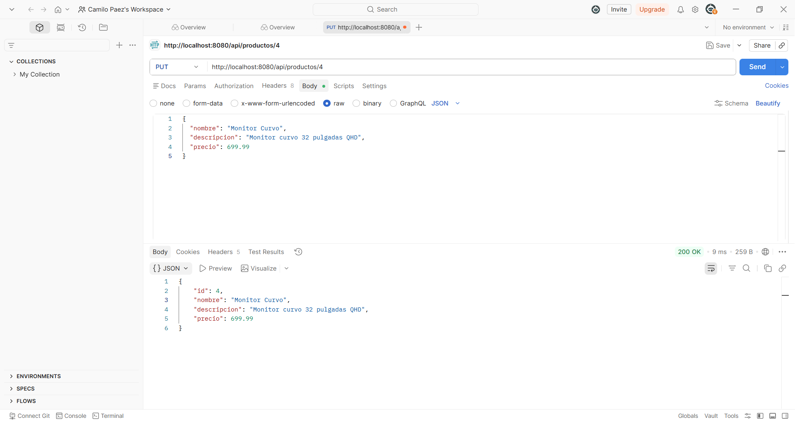
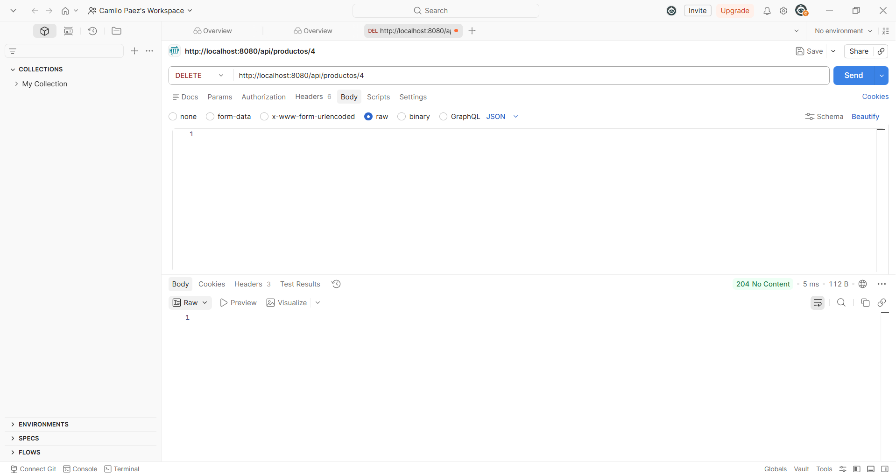

# API REST de Productos - Paez Post 2 Unidad 7

## 📋 Descripción del Proyecto

Este proyecto es una **API REST** desarrollada en **Spring Boot** que permite gestionar productos. Ofrece funcionalidades completas de CRUD (Crear, Leer, Actualizar, Eliminar) para administrar un catálogo de productos.

## 🎯 Funcionalidades Principales

- ✅ **Listar productos**: Obtener todos los productos disponibles
- ✅ **Crear producto**: Agregar nuevos productos al sistema
- ✅ **Editar producto**: Actualizar información de productos existentes
- ✅ **Eliminar producto**: Remover productos del sistema

## 🛠️ Tecnologías Utilizadas

- **Java 11+**
- **Spring Boot** - Framework principal
- **Spring Web** - Para desarrollo de APIs REST
- **Maven** - Gestor de dependencias y construcción del proyecto
- **H2 Database o MySQL** - Base de datos (según configuración)

## 📦 Requisitos Previos

Antes de ejecutar el proyecto, asegúrate de tener instalado:

- **Java Development Kit (JDK)** versión 11 o superior
- **Maven** versión 3.6 o superior
- **Git** (opcional, para clonar el repositorio)

## 🚀 Instalación y Ejecución

### 1. Clonar o descargar el proyecto

```bash
git clone <URL_DEL_REPOSITORIO>
cd paez-post2-u7
```

### 2. Construir el proyecto

```bash
./mvnw clean install
```

O en Windows:

```bash
mvnw.cmd clean install
```

### 3. Ejecutar la aplicación

```bash
./mvnw spring-boot:run
```

O en Windows:

```bash
mvnw.cmd spring-boot:run
```

La aplicación se ejecutará en: `http://localhost:8080`

## 📡 Endpoints de la API

### Listar todos los productos
```http
GET /api/productos
```

### Obtener un producto por ID
```http
GET /api/productos/{id}
```

### Crear un nuevo producto
```http
POST /api/productos
Content-Type: application/json

{
  "nombre": "Nombre del producto",
  "descripcion": "Descripción del producto",
  "precio": 99.99,
  "cantidad": 10
}
```

### Editar un producto existente
```http
PUT /api/productos/{id}
Content-Type: application/json

{
  "nombre": "Nombre actualizado",
  "descripcion": "Descripción actualizada",
  "precio": 109.99,
  "cantidad": 15
}
```

### Eliminar un producto
```http
DELETE /api/productos/{id}
```

## 📸 Evidencias de Funcionamiento

### 1. Lista de Productos
Visualización de todos los productos en el sistema:



*Pantalla que muestra la lista completa de productos disponibles en la API. Se pueden ver los detalles como nombre, descripción, precio y cantidad.*

### 2. Crear Producto
Formulario y proceso para agregar un nuevo producto:



*Pantalla que muestra el formulario para crear un nuevo producto. Se capturan los datos necesarios como nombre, descripción, precio y cantidad.*

### 3. Editar Producto
Interfaz para modificar los datos de un producto existente:



*Pantalla que permite actualizar la información de un producto seleccionado. Los campos vienen precargados con los datos actuales.*

### 4. Eliminar Producto
Confirmación y proceso de eliminación de productos:



*Pantalla que muestra la confirmación antes de eliminar un producto del sistema. Se solicita confirmación para evitar eliminaciones accidentales.*

## 📁 Estructura del Proyecto

```
paez-post2-u7/
├── src/
│   ├── main/
│   │   ├── java/com/paez/paezpost2u7/apiproductos/
│   │   │   ├── PaezPost2U7Application.java       (Clase principal)
│   │   │   ├── controller/
│   │   │   │   └── ProductoApiController.java    (Controlador REST)
│   │   │   ├── model/
│   │   │   │   └── Producto.java                 (Modelo de datos)
│   │   │   └── service/
│   │   │       └── ProductoService.java          (Lógica de negocio)
│   │   └── resources/
│   │       └── application.properties             (Configuración)
│   └── test/
│       └── java/.../PaezPost2U7ApplicationTests.java
├── screenshots/                                   (Evidencias)
├── pom.xml                                        (Dependencias Maven)
└── README.md                                      (Este archivo)
```

## 🔧 Configuración

El archivo `application.properties` contiene la configuración de la aplicación:

```properties
server.port=8080
spring.application.name=API-Productos
```

## 💡 Notas Importantes

- La API utiliza principios REST estándar
- Las respuestas se devuelven en formato JSON
- Se implementan validaciones en los datos de entrada
- La base de datos se configura según el ambiente (desarrollo, prueba, producción)

## 👨‍💻 Autor

**Cristian Camilo Páez Rodriguez**

## 📝 Licencia

Este proyecto es parte de la evaluación del curso POST 2 - UNIDAD 7.

---

*Última actualización: Junio 2026*

